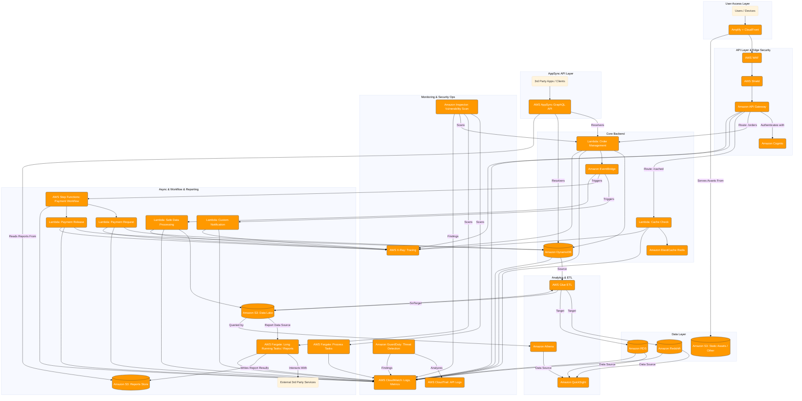

# Enterprise Architecture & Infrastructure

This documentation details the **enterprise phase** of our serverless application—built for full-scale, production-grade deployments. It includes:

* A comprehensive architecture diagram (`Enterprise.png`, `enterprise.mmd`)
* A CloudFormation template (`template.yaml`) provisioning security, networking, compute, data, and observability stacks  citeturn9file0

---

## Table of Contents

1. [Architecture Overview](#architecture-overview)
2. [Files in This Directory](#files-in-this-directory)
3. [Visual Diagram (Mermaid & PNG)](#visual-diagram-mermaid--png)
4. [CloudFormation Template Details](#cloudformation-template-details)

   * [Parameters](#parameters)
   * [Networking & VPC](#networking--vpc)
   * [Security & Edge Protection](#security--edge-protection)
   * [Authentication & API Layer](#authentication--api-layer)
   * [Compute & Orchestration](#compute--orchestration)
   * [Data Layer](#data-layer)
   * [Analytics & ETL](#analytics--etl)
   * [Observability & Security Ops](#observability--security-ops)
   * [Real-Time & Async Integration](#real-time--async-integration)
   * [Outputs](#outputs)
5. [Deployment Instructions](#deployment-instructions)
6. [Extending & Customization](#extending--customization)
7. [License](#license)

---

## Architecture Overview

In the **enterprise phase**, the system is enhanced for security, compliance, and scale:

* **User Access Layer**: Amplify + CloudFront for global SPA distribution
* **API Edge Protection**: AWS WAF & Shield guarding Amazon API Gateway
* **Authentication**: Amazon Cognito for user pools & AppSync for real-time GraphQL
* **Compute**: VPC‑isolated Lambdas with X‑Ray tracing, Step Functions orchestrating payments
* **Batch Processing**: AWS Fargate for long‑running tasks and AWS Glue ETL
* **Data Stores**: DynamoDB + Redis cache, RDS PostgreSQL, Redshift cluster, S3 data lake
* **Analytics & Dashboards**: Athena + QuickSight and OpenSearch dashboards
* **Observability & Security**: CloudWatch Logs/Dashboards, CloudTrail, GuardDuty, Inspector scans

This design meets enterprise requirements for isolation, threat detection, auditability, and real‑time capabilities.

---

## Files in This Directory

| File             | Description                                                                 |
| ---------------- | --------------------------------------------------------------------------- |
| `Enterprise.png` | PNG rendering of the enterprise architecture diagram                        |
| `enterprise.mmd` | Mermaid source for the diagram                                              |
| `template.yaml`  | CloudFormation template provisioning the enterprise stack citeturn9file0 |

---

## Visual Diagram (Mermaid & PNG)

**Mermaid Source** (`enterprise.mmd`): preview in VS Code with Mermaid extension:



**Static PNG**: `Enterprise.png` for embedding in presentations.

---

## CloudFormation Template Details

The `template.yaml` automates the enterprise-grade environment. Key sections:

### Parameters

| Parameter              | Type   | Description                                      |
| ---------------------- | ------ | ------------------------------------------------ |
| `ProjectName`          | String | Prefix for resource naming                       |
| `DbPasswordSecretName` | String | Secrets Manager key for RDS & Aurora credentials |

### Networking & VPC

* Creates a dedicated **VPC** with public subnets (A/B) and IGW
* **Route tables** and **security groups** isolating Lambda, RDS, and ElastiCache traffic

### Security & Edge Protection

* **AWS WAFv2** Web ACL with managed rule groups
* **AWS Shield** integration for DDoS defense
* **CloudTrail** for API auditing
* **Inspector** vulnerability scans on Lambda roles
* **GuardDuty** threat detection over VPC flow logs and CloudTrail

### Authentication & API Layer

* **Amazon Cognito** User Pool + App Client for JWT issuance
* **API Gateway** REST endpoints with Cognito authorizer and CORS
* **AppSync GraphQL API** for subscriptions and real-time updates

### Compute & Orchestration

* **AWS Lambda** placeholder functions for auth, orders, feedback, analytics, and payment steps—all VPC‑enabled and X‑Ray traced
* **AWS Step Functions** orchestrating multi-step payment workflow with retries and error handling
* **AWS Fargate** tasks for long‑running batch processing (>15 min)

### Data Layer

* **Amazon DynamoDB** tables (`Customers`, `Orders` with GSI, `Feedback`)
* **Amazon ElastiCache (Redis)** for caching hot keys
* **Amazon RDS PostgreSQL** in private subnets, credentials in Secrets Manager
* **Amazon Redshift** cluster for data warehousing
* **Amazon S3** bucket for data lake and static assets

### Analytics & ETL

* **AWS Glue** job for ETL between data sources (S3, RDS, Redshift)
* **Amazon Athena** for SQL-on-S3 queries
* **Amazon QuickSight** dashboards connecting to Athena and Redshift

### Observability & Security Ops

* **CloudWatch Logs & Metrics** with custom dashboards (`EnterpriseDashboard`)
* **OpenSearch** domain for centralized log analytics
* **CloudTrail** AWS API logs for audit
* **Inspector** continuous assessments

### Real-Time & Async Integration

* **EventBridge** (commented example) for decoupled cross-service events
* **AppSync Subscriptions** for order status updates in real time

### Outputs

| Output                         | Description                             |
| ------------------------------ | --------------------------------------- |
| `ApiEndpoint`                  | REST API invoke URL (stage: `showcase`) |
| `CognitoUserPoolId`            | Cognito User Pool ID                    |
| `AppSyncApiId`                 | AppSync GraphQL API ID                  |
| `CustomersTableName`           | DynamoDB Customers table name           |
| `OrdersTableName`              | DynamoDB Orders table name              |
| `FeedbackTableName`            | DynamoDB Feedback table name            |
| `PaymentStateMachineArn`       | ARN of Step Functions payment processor |
| `RedisCacheEndpoint`           | Redis cluster endpoint                  |
| `AnalyticsDBEndpoint`          | RDS PostgreSQL endpoint                 |
| `RedshiftClusterEndpoint`      | Redshift cluster endpoint               |
| `LogsOpenSearchDomainEndpoint` | OpenSearch domain endpoint              |
| `VpcId`                        | VPC ID                                  |
| `PublicSubnetIds`              | Comma‑separated public subnet IDs       |

---

## Deployment Instructions

Deploy via AWS CLI:

```bash
aws cloudformation deploy \
  --stack-name enterprise-backend-stack \
  --template-file template.yaml \
  --parameter-overrides \
    ProjectName=MyEnterpriseProj \
    DbPasswordSecretName=MyEnterpriseDbSecret \
  --capabilities CAPABILITY_NAMED_IAM
```

Monitor stack events in the AWS CloudFormation Console. Once deployed, retrieve outputs for API endpoints and resource identifiers.

---


## License

MIT License. Adapt freely for your enterprise environment.
