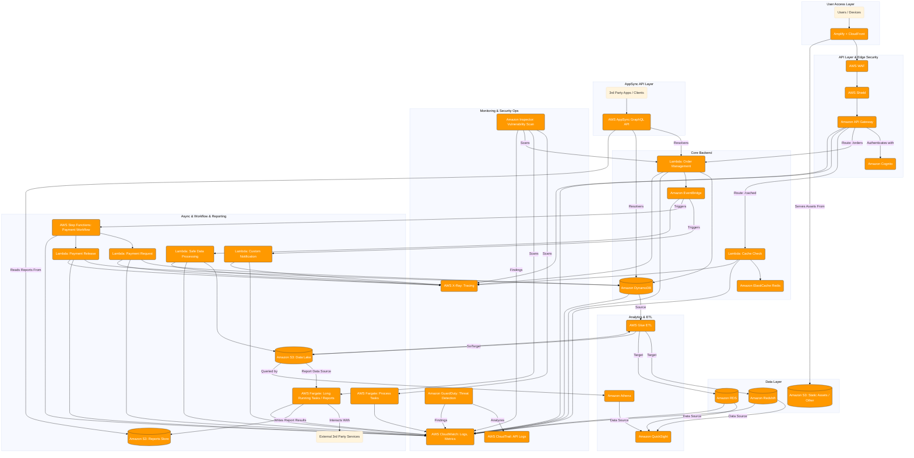

# Enterprise Architecture & Infrastructure

This documentation details the **enterprise phase** of our serverless application—built for full-scale, production-grade deployments. It includes:

* A comprehensive architecture diagram (`Enterprise.png`, `enterprise.mmd`)
* A CloudFormation template (`template.yaml`) provisioning security, networking, compute, data, and observability stacks  citeturn9file0

---

## Table of Contents

1. [Architecture Overview](#architecture-overview)
2. [Files in This Directory](#files-in-this-directory)
3. [Visual Diagram (Mermaid & PNG)](#visual-diagram-mermaid--png)
4. [CloudFormation Template Details](#cloudformation-template-details)

   * [Parameters](#parameters)
   * [Networking & VPC](#networking--vpc)
   * [Security & Edge Protection](#security--edge-protection)
   * [Authentication & API Layer](#authentication--api-layer)
   * [Compute & Orchestration](#compute--orchestration)
   * [Data Layer](#data-layer)
   * [Analytics & ETL](#analytics--etl)
   * [Observability & Security Ops](#observability--security-ops)
   * [Real-Time & Async Integration](#real-time--async-integration)
   * [Outputs](#outputs)
5. [Deployment Instructions](#deployment-instructions)
6. [Extending & Customization](#extending--customization)
7. [License](#license)

---

## Architecture Overview

In the **enterprise phase**, the system is enhanced for security, compliance, and scale:

* **User Access Layer**: Amplify + CloudFront for global SPA distribution
* **API Edge Protection**: AWS WAF & Shield guarding Amazon API Gateway
* **Authentication**: Amazon Cognito for user pools & AppSync for real-time GraphQL
* **Compute**: VPC‑isolated Lambdas with X‑Ray tracing, Step Functions orchestrating payments
* **Batch Processing**: AWS Fargate for long‑running tasks and AWS Glue ETL
* **Data Stores**: DynamoDB + Redis cache, RDS PostgreSQL, Redshift cluster, S3 data lake
* **Analytics & Dashboards**: Athena + QuickSight and OpenSearch dashboards
* **Observability & Security**: CloudWatch Logs/Dashboards, CloudTrail, GuardDuty, Inspector scans

This design meets enterprise requirements for isolation, threat detection, auditability, and real‑time capabilities.

---

## Files in This Directory

| File             | Description                                                                 |
| ---------------- | --------------------------------------------------------------------------- |
| `Enterprise.png` | PNG rendering of the enterprise architecture diagram                        |
| `enterprise.mmd` | Mermaid source for the diagram                                              |
| `template.yaml`  | CloudFormation template provisioning the enterprise stack citeturn9file0 |

---

## Visual Diagram (Mermaid & PNG)

**Mermaid Source** (`enterprise.mmd`): preview in VS Code with Mermaid extension:



**Static PNG**: `Enterprise.png` for embedding in presentations.

---

## CloudFormation Template Details

The `template.yaml` automates the enterprise-grade environment. Key sections:

### Parameters

| Parameter              | Type   | Description                                      |
| ---------------------- | ------ | ------------------------------------------------ |
| `ProjectName`          | String | Prefix for resource naming                       |
| `DbPasswordSecretName` | String | Secrets Manager key for RDS & Aurora credentials |

### Networking & VPC

* Creates a dedicated **VPC** with public subnets (A/B) and IGW
* **Route tables** and **security groups** isolating Lambda, RDS, and ElastiCache traffic

### Security & Edge Protection

* **AWS WAFv2** Web ACL with managed rule groups
* **AWS Shield** integration for DDoS defense
* **CloudTrail** for API auditing
* **Inspector** vulnerability scans on Lambda roles
* **GuardDuty** threat detection over VPC flow logs and CloudTrail

### Authentication & API Layer

* **Amazon Cognito** User Pool + App Client for JWT issuance
* **API Gateway** REST endpoints with Cognito authorizer and CORS
* **AppSync GraphQL API** for subscriptions and real-time updates

### Compute & Orchestration

* **AWS Lambda** placeholder functions for auth, orders, feedback, analytics, and payment steps—all VPC‑enabled and X‑Ray traced
* **AWS Step Functions** orchestrating multi-step payment workflow with retries and error handling
* **AWS Fargate** tasks for long‑running batch processing (>15 min)

### Data Layer

* **Amazon DynamoDB** tables (`Customers`, `Orders` with GSI, `Feedback`)
* **Amazon ElastiCache (Redis)** for caching hot keys
* **Amazon RDS PostgreSQL** in private subnets, credentials in Secrets Manager
* **Amazon Redshift** cluster for data warehousing
* **Amazon S3** bucket for data lake and static assets

### Analytics & ETL

* **AWS Glue** job for ETL between data sources (S3, RDS, Redshift)
* **Amazon Athena** for SQL-on-S3 queries
* **Amazon QuickSight** dashboards connecting to Athena and Redshift

### Observability & Security Ops

* **CloudWatch Logs & Metrics** with custom dashboards (`EnterpriseDashboard`)
* **OpenSearch** domain for centralized log analytics
* **CloudTrail** AWS API logs for audit
* **Inspector** continuous assessments

### Real-Time & Async Integration

* **EventBridge** (commented example) for decoupled cross-service events
* **AppSync Subscriptions** for order status updates in real time

### Outputs

| Output                         | Description                             |
| ------------------------------ | --------------------------------------- |
| `ApiEndpoint`                  | REST API invoke URL (stage: `showcase`) |
| `CognitoUserPoolId`            | Cognito User Pool ID                    |
| `AppSyncApiId`                 | AppSync GraphQL API ID                  |
| `CustomersTableName`           | DynamoDB Customers table name           |
| `OrdersTableName`              | DynamoDB Orders table name              |
| `FeedbackTableName`            | DynamoDB Feedback table name            |
| `PaymentStateMachineArn`       | ARN of Step Functions payment processor |
| `RedisCacheEndpoint`           | Redis cluster endpoint                  |
| `AnalyticsDBEndpoint`          | RDS PostgreSQL endpoint                 |
| `RedshiftClusterEndpoint`      | Redshift cluster endpoint               |
| `LogsOpenSearchDomainEndpoint` | OpenSearch domain endpoint              |
| `VpcId`                        | VPC ID                                  |
| `PublicSubnetIds`              | Comma‑separated public subnet IDs       |

---

## Deployment Instructions

Deploy via AWS CLI:

```bash
sam build

sam deploy `
  --stack-name enterprise-backend-stack `
  --template-file template.yaml `
  --parameter-overrides `
    ProjectName=myenterpriseproj `
    DbPasswordSecretName=MyEnterpriseDbSecret `
  --capabilities CAPABILITY_NAMED_IAM `
  --s3-bucket=aws-sam-cli-managed-default-samclisourcebucket-5pxpxnglaqld
```

Monitor stack events in the AWS CloudFormation Console. Once deployed, retrieve outputs for API endpoints and resource identifiers.

---

# TESTING
1. Set API Endpoint, Cognito User Pool ID, and Client ID:
```
$ApiEndpoint = ""
$CognitoUserPoolId = ""
$CognitoUserPoolClientId = ""
```
2. Initialize/Reset Test Variables (with a new unique email):
```
$IdToken = $null
$UserId = $null
$OrderId = $null
$Global:psNewRunEmail = "newrun" + (Get-Date -Format "yyyyMMddHHmmss") + "@example.com"
$Global:psNewRunPassword = "ComplexP@ss" + (Get-Random -Minimum 1000 -Maximum 9999) # Example
Write-Host "Using new email for registration: $($Global:psNewRunEmail)"
Write-Host "Using password: $($Global:psNewRunPassword)"
```
3. Registration:
```
<!-- Define Registration Payload: -->
$registerPayload = @{
    email = $Global:psNewRunEmail
    password = $Global:psNewRunPassword
    firstName = "NewRun"
    lastName = "Test"
    phoneNumber = "+1" + (Get-Random -Minimum 1000000000 -Maximum 1999999999) 
} | ConvertTo-Json

<!-- Send Registration Request: -->
Write-Host "Attempting to register new user: $($Global:psNewRunEmail)"
try {
    $registerResponse = Invoke-RestMethod -Uri "$ApiEndpoint/register" -Method Post -Body $registerPayload -ContentType "application/json" -ErrorAction Stop
    Write-Host "✅ Registration successful!" -ForegroundColor Green
    $registerResponse | ConvertTo-Json -Depth 3 | Write-Output
    $UserId = $registerResponse.userSub 
    Write-Host "Registered UserId (userSub): $UserId"
} catch {
    Write-Host "❌ Registration failed!" -ForegroundColor Red
    Write-Host "Status Code: $($_.Exception.Response.StatusCode.value__)"
    $_.Exception.Response.GetResponseStream() | ForEach-Object { $reader = New-Object System.IO.StreamReader $_; $reader.ReadToEnd() } | Write-Output
}

```

4. Login:
```
<!-- Define Login Payload: -->
$loginPayload = @{
    email = $Global:psNewRunEmail
    password = $Global:psNewRunPassword
} | ConvertTo-Json


<!-- Send Login Request: -->
Write-Host "Attempting to login user: $($Global:psNewRunEmail)"
try {
    $loginResponse = Invoke-RestMethod -Uri "$ApiEndpoint/login" -Method Post -Body $loginPayload -ContentType "application/json" -ErrorAction Stop
    Write-Host "✅ Login successful!" -ForegroundColor Green
    $loginResponse | ConvertTo-Json -Depth 3 | Write-Output
    $IdToken = $loginResponse.idToken
    Write-Host "ID Token captured successfully."
} catch {
    Write-Host "❌ Login failed!" -ForegroundColor Red
    Write-Host "Status Code: $($_.Exception.Response.StatusCode.value__)"
    $_.Exception.Response.GetResponseStream() | ForEach-Object { $reader = New-Object System.IO.StreamReader $_; $reader.ReadToEnd() } | Write-Output
}

```

5. Create an Order:
```
<!-- Check variables and define headers: -->
if (-not $IdToken -or -not $UserId) { Write-Error "Missing UserId or IdToken! Please ensure Login (Step 2) was successful and returned a valid token."; return }
Write-Host "Using UserId: $UserId"
$headers = @{
    "Authorization" = $IdToken
    "Content-Type"  = "application/json"
}

<!-- Define Order Payload: -->
$createOrderPayload = @{
    userId = $UserId
    items = @(
        @{ productId = "NEWPROD001"; productName = "Fresh Product"; quantity = 2; price = 25.00 },
        @{ productId = "NEWPROD002"; productName = "Another Item"; quantity = 1; price = 49.50 }
    )
    shippingAddress = @{
        street = "789 New Deploy Ave"
        city = "CloudNine"
        zipCode = "11223"
        country = "DE"
    }
} | ConvertTo-Json

<!-- Send Create Order Request: -->
Write-Host "Attempting to create an order for UserId: $UserId"
try {
    $createOrderResponse = Invoke-RestMethod -Uri "$ApiEndpoint/orders" -Method Post -Body $createOrderPayload -Headers $headers -ErrorAction Stop
    Write-Host "✅ Order creation successful!" -ForegroundColor Green
    $createOrderResponse | ConvertTo-Json -Depth 3 | Write-Output
    $OrderId = $createOrderResponse.orderId
    Write-Host "Created Order ID: $OrderId"
} catch {
    Write-Host "❌ Order creation failed!" -ForegroundColor Red
    Write-Host "Status Code: $($_.Exception.Response.StatusCode.value__)"
    $_.Exception.Response.GetResponseStream() | ForEach-Object { $reader = New-Object System.IO.StreamReader $_; $reader.ReadToEnd() } | Write-Output
}

```

6.  Get Orders for a User
```
<!-- Send Get Orders Request: -->
if (-not $headers) { Write-Error "Headers not set. Ensure login was successful."; return }
Write-Host "Attempting to get orders for UserId: $UserId"
try {
    $getOrdersResponse = Invoke-RestMethod -Uri "$ApiEndpoint/orders?userId=$UserId" -Method Get -Headers $headers -ErrorAction Stop
    Write-Host "✅ Get orders successful!" -ForegroundColor Green
    $getOrdersResponse | ConvertTo-Json -Depth 4 | Write-Output
} catch {
    Write-Host "❌ Get orders failed!" -ForegroundColor Red
    Write-Host "Status Code: $($_.Exception.Response.StatusCode.value__)"
    $_.Exception.Response.GetResponseStream() | ForEach-Object { $reader = New-Object System.IO.StreamReader $_; $reader.ReadToEnd() } | Write-Output
}

```

7.  Get Order Details by ID
```
<!-- Check $OrderId (optional): -->
if (-not $OrderId) { Write-Error "OrderId not found. Ensure 'Create Order' (Step 3) was successful."; return }

<!-- Send Get Order Details Request: -->
if (-not $headers) { Write-Error "Headers not set. Ensure login was successful."; return }
Write-Host "Attempting to get order details for Order ID: $OrderId"
try {
    $orderDetailsResponse = Invoke-RestMethod -Uri "$ApiEndpoint/orders/$OrderId" -Method Get -Headers $headers -ErrorAction Stop
    Write-Host "✅ Get order details successful!" -ForegroundColor Green
    $orderDetailsResponse | ConvertTo-Json -Depth 4 | Write-Output
} catch {
    Write-Host "❌ Get order details failed!" -ForegroundColor Red
    Write-Host "Status Code: $($_.Exception.Response.StatusCode.value__)"
    $_.Exception.Response.GetResponseStream() | ForEach-Object { $reader = New-Object System.IO.StreamReader $_; $reader.ReadToEnd() } | Write-Output
}
```
8.  Submit Feedback
```
<!-- Define Feedback Payload: -->
if (-not $headers) { Write-Error "Headers not set. Ensure login was successful."; return }
$feedbackPayload = @{
    userId = $UserId
    orderId = $OrderId 
    rating = 5 
    comment = "Testing new deployment $(Get-Date) - Feedback function."
    category = "Deployment Test"
} | ConvertTo-Json

<!-- Send Submit Feedback Request: -->
Write-Host "Attempting to submit feedback for UserId: $UserId"
try {
    $feedbackResponse = Invoke-RestMethod -Uri "$ApiEndpoint/feedback" -Method Post -Body $feedbackPayload -Headers $headers -ErrorAction Stop
    Write-Host "✅ Submit feedback successful!" -ForegroundColor Green
    $feedbackResponse | ConvertTo-Json -Depth 3 | Write-Output
} catch {
    Write-Host "❌ Submit feedback failed!" -ForegroundColor Red
    Write-Host "Status Code: $($_.Exception.Response.StatusCode.value__)"
    $_.Exception.Response.GetResponseStream() | ForEach-Object { $reader = New-Object System.IO.StreamReader $_; $reader.ReadToEnd() } | Write-Output
}

```

9.  Get Analytics
```
<!-- Send Get Analytics Request (Summary): -->
if (-not $headers) { Write-Error "Headers not set. Ensure login was successful."; return }
Write-Host "Attempting to get analytics (summary report)"
try {
    $analyticsResponse = Invoke-RestMethod -Uri "$ApiEndpoint/analytics" -Method Get -Headers $headers -ErrorAction Stop
    Write-Host "✅ Get analytics (summary) successful!" -ForegroundColor Green
    $analyticsResponse | ConvertTo-Json -Depth 4 | Write-Output
} catch {
    Write-Host "❌ Get analytics (summary) failed!" -ForegroundColor Red
    Write-Host "Status Code: $($_.Exception.Response.StatusCode.value__)"
    $_.Exception.Response.GetResponseStream() | ForEach-Object { $reader = New-Object System.IO.StreamReader $_; $reader.ReadToEnd() } | Write-Output
}

<!-- (Optional) Send Get Analytics Request (Detailed): -->
if (-not $headers) { Write-Error "Headers not set. Ensure login was successful."; return }
Write-Host "Attempting to get analytics (detailed report)"
try {
    $analyticsDetailedResponse = Invoke-RestMethod -Uri "$ApiEndpoint/analytics?reportType=detailed" -Method Get -Headers $headers -ErrorAction Stop
    Write-Host "✅ Get analytics (detailed) successful!" -ForegroundColor Green
    $analyticsDetailedResponse | ConvertTo-Json -Depth 5 | Write-Output
} catch {
    Write-Host "❌ Get analytics (detailed) failed!" -ForegroundColor Red
    Write-Host "Status Code: $($_.Exception.Response.StatusCode.value__)"
    $_.Exception.Response.GetResponseStream() | ForEach-Object { $reader = New-Object System.IO.StreamReader $_; $reader.ReadToEnd() } | Write-Output
}
```


## License

MIT License. Adapt freely for your enterprise environment.
