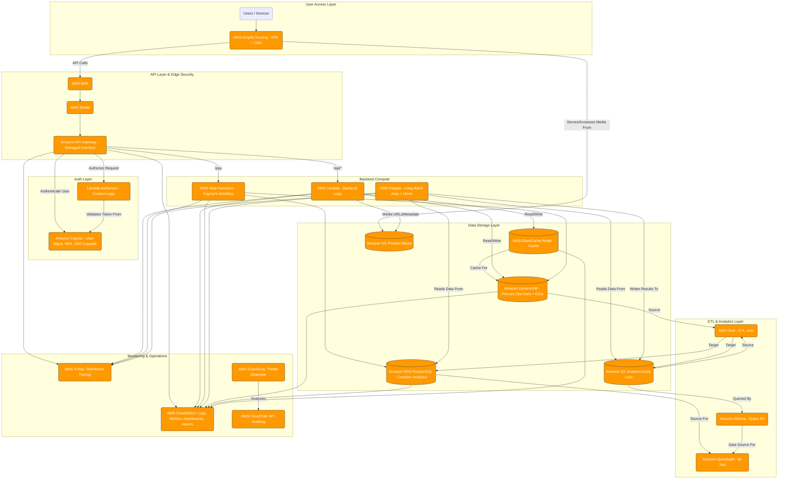

# Scale‑Up Architecture & Infrastructure

This documentation describes the **scale‑up phase** of our serverless application, showcasing a hardened, enterprise‑ready structure. You’ll find:

* A high‑level architecture diagram (`Scale‑up.png` and `scale‑up.mmd`)
* A CloudFormation template (`template.yaml`) to provision networking, security, compute, data stores, and API layers  citeturn8file0

---

## Table of Contents

1. [Architecture Overview](#architecture-overview)
2. [Files in This Directory](#files-in-this-directory)
3. [Visual Diagram (Mermaid & PNG)](#visual-diagram-mermaid--png)
4. [CloudFormation Template Details](#cloudformation-template-details)

   * [Parameters](#parameters)
   * [Networking & Security](#networking--security)
   * [Data Stores](#data-stores)
   * [Compute & Orchestration](#compute--orchestration)
   * [API Layer](#api-layer)
   * [IAM Roles & Permissions](#iam-roles--permissions)
   * [Outputs](#outputs)
5. [Deployment Instructions](#deployment-instructions)
6. [Extending & Customization](#extending--customization)
7. [License](#license)

---


## Files in This Directory

| File            | Description                                                                      |
| --------------- | -------------------------------------------------------------------------------- |
| `Scale‑up.png`  | PNG rendering of the scale‑up architecture diagram                               |
| `scale‑up.mmd`  | Mermaid source for the diagram                                                   |
| `template.yaml` | CloudFormation template provisioning the entire scale‑up stack citeturn8file0 |

---

## Visual Diagram (Mermaid & PNG)

**Mermaid Source** (`scale‑up.mmd`): open in VS Code with a Mermaid extension to live‑preview:



**Static PNG**: `Scale‑up.png` for quick reference or embedding in docs.

---

## CloudFormation Template Details

The `template.yaml` brings up a complete scale‑up environment. Below is a summary of its key sections.

### Parameters

| Parameter              | Type   | Description                                   |
| ---------------------- | ------ | --------------------------------------------- |
| `ProjectName`          | String | Prefix for generating resource names          |
| `DbPasswordSecretName` | String | Secrets Manager entry for RDS master password |

### Networking & Security

* **VPC** with two public subnets (A/B) and Internet gateway
* **Route Table** and public routes for outbound access
* **Security Groups** for Lambdas, ElastiCache, and RDS

### Data Stores

* **DynamoDB** tables for `Customers`, `Orders` (with GSI), and `Feedback`
* **ElastiCache Redis** cluster in the VPC for hot‑data caching
* **RDS PostgreSQL** instance (private subnets) with credentials in Secrets Manager
* **Secrets Manager** secret for RDS master credentials

### Compute & Orchestration

* **Lambda Functions** (auth, order‑processing, feedback, analytics, payment placeholders) running inside the VPC, with X‑Ray tracing enabled
* **AWS Step Functions** state machine orchestrating multi‑step payment processing with retry and catch logic
* **AWS Fargate (optional)** for long‑running batch jobs (>15 min)

### API Layer

* **AWS WAF & Shield** (referenced in diagram) for edge security
* **Amazon API Gateway** (regional) exposing REST endpoints (register, login, orders, feedback, analytics)
* **Cognito User Pool** authorizer for protected routes
* **OPTIONS** methods configured for CORS

### IAM Roles & Permissions

* Fine‑grained **IAM Roles** for each Lambda category (Auth, Order, Feedback, Analytics, Payment) granting only necessary DynamoDB, Cognito, SecretsManager, and network privileges
* **Step Functions** role allowing Lambda invocations and X‑Ray permissions
* **API Gateway** CloudWatch logs role for detailed request tracing

### Outputs

| Output                   | Description                                |
| ------------------------ | ------------------------------------------ |
| `ApiEndpoint`            | Invoke URL for the API stage (`/showcase`) |
| `CognitoUserPoolId`      | ID of the Cognito User Pool                |
| `CustomersTableName`     | Name of the DynamoDB `Customers` table     |
| `OrdersTableName`        | Name of the DynamoDB `Orders` table        |
| `FeedbackTableName`      | Name of the DynamoDB `Feedback` table      |
| `PaymentStateMachineArn` | ARN of the Step Functions state machine    |
| `RedisCacheEndpoint`     | Redis cluster endpoint address             |
| `AnalyticsDBEndpoint`    | RDS PostgreSQL endpoint                    |
| `PublicSubnetIds`        | Comma‑separated public subnet IDs          |
| `VpcId`                  | VPC ID                                     |

---

## Deployment Instructions

```bash
aws cloudformation deploy \
  --stack-name scaleup-backend-stack \
  --template-file template.yaml \
  --parameter-overrides \
     ProjectName=MyScaleUpProj \
     DbPasswordSecretName=MyScaleUpDbSecret \
  --capabilities CAPABILITY_NAMED_IAM
```

Monitor progress in the CloudFormation console. Once complete, note the `ApiEndpoint` output for your REST APIs.

---

## License

MIT License. Feel free to adapt and tailor this template for your scaling requirements.
