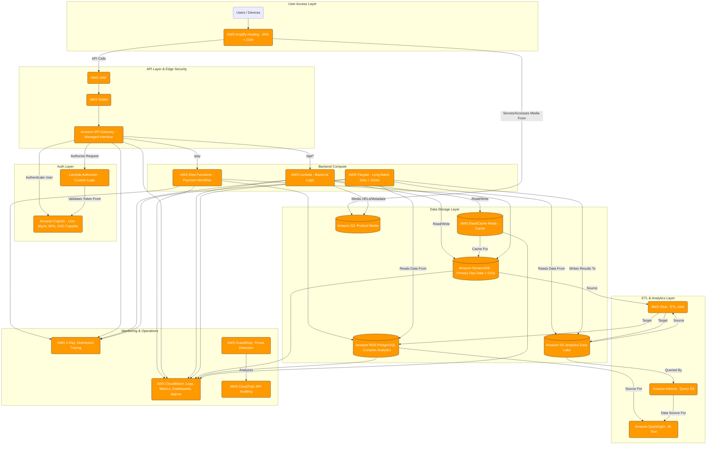

# Scale‑Up Architecture & Infrastructure

This documentation describes the **scale‑up phase** of our serverless application, showcasing a hardened, enterprise‑ready structure. You’ll find:

* A high‑level architecture diagram (`Scale‑up.png` and `scale‑up.mmd`)
* A CloudFormation template (`template.yaml`) to provision networking, security, compute, data stores, and API layers  citeturn8file0

---

## Table of Contents

1. [Architecture Overview](#architecture-overview)
2. [Files in This Directory](#files-in-this-directory)
3. [Visual Diagram (Mermaid & PNG)](#visual-diagram-mermaid--png)
4. [CloudFormation Template Details](#cloudformation-template-details)

   * [Parameters](#parameters)
   * [Networking & Security](#networking--security)
   * [Data Stores](#data-stores)
   * [Compute & Orchestration](#compute--orchestration)
   * [API Layer](#api-layer)
   * [IAM Roles & Permissions](#iam-roles--permissions)
   * [Outputs](#outputs)
5. [Deployment Instructions](#deployment-instructions)
6. [Extending & Customization](#extending--customization)
7. [License](#license)

---


## Files in This Directory

| File            | Description                                                                      |
| --------------- | -------------------------------------------------------------------------------- |
| `Scale‑up.png`  | PNG rendering of the scale‑up architecture diagram                               |
| `scale‑up.mmd`  | Mermaid source for the diagram                                                   |
| `template.yaml` | CloudFormation template provisioning the entire scale‑up stack citeturn8file0 |

---

## Visual Diagram (Mermaid & PNG)

**Mermaid Source** (`scale‑up.mmd`): open in VS Code with a Mermaid extension to live‑preview:



**Static PNG**: `Scale‑up.png` for quick reference or embedding in docs.

---

## CloudFormation Template Details

The `template.yaml` brings up a complete scale‑up environment. Below is a summary of its key sections.

### Parameters

| Parameter              | Type   | Description                                   |
| ---------------------- | ------ | --------------------------------------------- |
| `ProjectName`          | String | Prefix for generating resource names          |
| `DbPasswordSecretName` | String | Secrets Manager entry for RDS master password |

### Networking & Security

* **VPC** with two public subnets (A/B) and Internet gateway
* **Route Table** and public routes for outbound access
* **Security Groups** for Lambdas, ElastiCache, and RDS

### Data Stores

* **DynamoDB** tables for `Customers`, `Orders` (with GSI), and `Feedback`
* **ElastiCache Redis** cluster in the VPC for hot‑data caching
* **RDS PostgreSQL** instance (private subnets) with credentials in Secrets Manager
* **Secrets Manager** secret for RDS master credentials

### Compute & Orchestration

* **Lambda Functions** (auth, order‑processing, feedback, analytics, payment placeholders) running inside the VPC, with X‑Ray tracing enabled
* **AWS Step Functions** state machine orchestrating multi‑step payment processing with retry and catch logic
* **AWS Fargate (optional)** for long‑running batch jobs (>15 min)

### API Layer

* **AWS WAF & Shield** (referenced in diagram) for edge security
* **Amazon API Gateway** (regional) exposing REST endpoints (register, login, orders, feedback, analytics)
* **Cognito User Pool** authorizer for protected routes
* **OPTIONS** methods configured for CORS

### IAM Roles & Permissions

* Fine‑grained **IAM Roles** for each Lambda category (Auth, Order, Feedback, Analytics, Payment) granting only necessary DynamoDB, Cognito, SecretsManager, and network privileges
* **Step Functions** role allowing Lambda invocations and X‑Ray permissions
* **API Gateway** CloudWatch logs role for detailed request tracing

### Outputs

| Output                   | Description                                |
| ------------------------ | ------------------------------------------ |
| `ApiEndpoint`            | Invoke URL for the API stage (`/showcase`) |
| `CognitoUserPoolId`      | ID of the Cognito User Pool                |
| `CustomersTableName`     | Name of the DynamoDB `Customers` table     |
| `OrdersTableName`        | Name of the DynamoDB `Orders` table        |
| `FeedbackTableName`      | Name of the DynamoDB `Feedback` table      |
| `PaymentStateMachineArn` | ARN of the Step Functions state machine    |
| `RedisCacheEndpoint`     | Redis cluster endpoint address             |
| `AnalyticsDBEndpoint`    | RDS PostgreSQL endpoint                    |
| `PublicSubnetIds`        | Comma‑separated public subnet IDs          |
| `VpcId`                  | VPC ID                                     |

---

## Deployment Instructions

```bash
sam build

sam deploy `
  --stack-name scaleup-backend-stack `
  --template-file template.yaml `
  --parameter-overrides `
     ProjectName=myscaleupproj `
     DbPasswordSecretName=MyScaleUpDbSecret `
  --capabilities CAPABILITY_NAMED_IAM `
  --s3-bucket=aws-sam-cli-managed-default-samclisourcebucket-5pxpxnglaqld
```

Monitor progress in the CloudFormation console. Once complete, note the `ApiEndpoint` output for your REST APIs.

---

## TESTING
1. set envs
```
$ApiEndpoint = ""
$CognitoUserPoolId = ""
$CognitoUserPoolClientId = ""
```

2. Initialize/Reset Test Variables:
```
$IdToken = $null
$UserId = $null
$OrderId = $null
$Global:psTestEmail = "directcmd" + (Get-Date -Format "yyyyMMddHHmmss") + "@example.com"
$Global:psTestPassword = "CmdP@$$wOrd" + (Get-Random -Minimum 100 -Maximum 999) + "!"
Write-Host "Using new email for registration: $($Global:psTestEmail)"
Write-Host "Using password: $($Global:psTestPassword)"
```

3. Register a New User:
```
$registerPayload = @{
    email = $Global:psTestEmail
    password = $Global:psTestPassword
    firstName = "DirectCmd"
    lastName = "TestUser"
    phoneNumber = "+1" + (Get-Random -Minimum 1000000000 -Maximum 1999999999) 
} | ConvertTo-Json
```

4. Send Registration Request:
```
Write-Host "Attempting to register new user: $($Global:psTestEmail)"
try {
    $registerResponse = Invoke-RestMethod -Uri "$ApiEndpoint/register" -Method Post -Body $registerPayload -ContentType "application/json" -ErrorAction Stop
    Write-Host "✅ Registration successful!" -ForegroundColor Green
    $registerResponse | ConvertTo-Json -Depth 3 | Write-Output
    $UserId = $registerResponse.userSub 
    Write-Host "Registered UserId (userSub): $UserId"
} catch {
    Write-Host "❌ Registration failed!" -ForegroundColor Red
    Write-Host "Status Code: $($_.Exception.Response.StatusCode.value__)"
    $_.Exception.Response.GetResponseStream() | ForEach-Object { $reader = New-Object System.IO.StreamReader $_; $reader.ReadToEnd() } | Write-Output
}
```
5. Login User
```
$loginPayload = @{
    email = $Global:psTestEmail
    password = $Global:psTestPassword
} | ConvertTo-Json
```
6. Send Login Request:
```
Write-Host "Attempting to login user: $($Global:psTestEmail)"
try {
    $loginResponse = Invoke-RestMethod -Uri "$ApiEndpoint/login" -Method Post -Body $loginPayload -ContentType "application/json" -ErrorAction Stop
    Write-Host "✅ Login successful!" -ForegroundColor Green
    $loginResponse | ConvertTo-Json -Depth 3 | Write-Output
    $IdToken = $loginResponse.idToken
    Write-Host "ID Token captured successfully."
} catch {
    Write-Host "❌ Login failed!" -ForegroundColor Red
    Write-Host "Status Code: $($_.Exception.Response.StatusCode.value__)"
    $_.Exception.Response.GetResponseStream() | ForEach-Object { $reader = New-Object System.IO.StreamReader $_; $reader.ReadToEnd() } | Write-Output
}
```
7.  Create an Order
```
<!-- Check variables and define headers:  -->
if (-not $IdToken -or -not $UserId) { Write-Error "Missing UserId or IdToken! Please ensure Login (Step 2) was successful and returned a valid token."; return }
Write-Host "Using UserId: $UserId"
$headers = @{
    "Authorization" = $IdToken
    "Content-Type"  = "application/json"
}

<!-- Define Order Payload: -->
$createOrderPayload = @{
    userId = $UserId
    items = @(
        @{ productId = "ITEM001"; productName = "Test Item Alpha"; quantity = 1; price = 19.99 },
        @{ productId = "ITEM002"; productName = "Test Item Beta"; quantity = 2; price = 7.50 }
    )
    shippingAddress = @{
        street = "456 Test Ave"
        city = "CmdVille"
        zipCode = "98765"
        country = "DE"
    }
} | ConvertTo-Json

<!-- Send Create Order Request: -->
Write-Host "Attempting to create an order for UserId: $UserId"
try {
    $createOrderResponse = Invoke-RestMethod -Uri "$ApiEndpoint/orders" -Method Post -Body $createOrderPayload -Headers $headers -ErrorAction Stop
    Write-Host "✅ Order creation successful!" -ForegroundColor Green
    $createOrderResponse | ConvertTo-Json -Depth 3 | Write-Output
    $OrderId = $createOrderResponse.orderId
    Write-Host "Created Order ID: $OrderId"
} catch {
    Write-Host "❌ Order creation failed!" -ForegroundColor Red
    Write-Host "Status Code: $($_.Exception.Response.StatusCode.value__)"
    $_.Exception.Response.GetResponseStream() | ForEach-Object { $reader = New-Object System.IO.StreamReader $_; $reader.ReadToEnd() } | Write-Output
}
```

8.  Get Orders for a User
```
if (-not $headers) { Write-Error "Headers not set. Ensure login was successful."; return }
Write-Host "Attempting to get orders for UserId: $UserId"
try {
    $getOrdersResponse = Invoke-RestMethod -Uri "$ApiEndpoint/orders?userId=$UserId" -Method Get -Headers $headers -ErrorAction Stop
    Write-Host "✅ Get orders successful!" -ForegroundColor Green
    $getOrdersResponse | ConvertTo-Json -Depth 4 | Write-Output
} catch {
    Write-Host "❌ Get orders failed!" -ForegroundColor Red
    Write-Host "Status Code: $($_.Exception.Response.StatusCode.value__)"
    $_.Exception.Response.GetResponseStream() | ForEach-Object { $reader = New-Object System.IO.StreamReader $_; $reader.ReadToEnd() } | Write-Output
}
```
9. Get Order Details by ID
```
<!-- Check $OrderId if exists: -->
if (-not $OrderId) { Write-Error "OrderId not found. Ensure 'Create Order' (Step 3) was successful."; return }

<!-- Send Get Order Details Request: -->
if (-not $headers) { Write-Error "Headers not set. Ensure login was successful."; return }
Write-Host "Attempting to get order details for Order ID: $OrderId"
try {
    $orderDetailsResponse = Invoke-RestMethod -Uri "$ApiEndpoint/orders/$OrderId" -Method Get -Headers $headers -ErrorAction Stop
    Write-Host "✅ Get order details successful!" -ForegroundColor Green
    $orderDetailsResponse | ConvertTo-Json -Depth 4 | Write-Output
} catch {
    Write-Host "❌ Get order details failed!" -ForegroundColor Red
    Write-Host "Status Code: $($_.Exception.Response.StatusCode.value__)"
    $_.Exception.Response.GetResponseStream() | ForEach-Object { $reader = New-Object System.IO.StreamReader $_; $reader.ReadToEnd() } | Write-Output
}
```


10. Submit Feedback
```
<!-- Define Feedback Payload: -->
if (-not $headers) { Write-Error "Headers not set. Ensure login was successful."; return }
$feedbackPayload = @{
    userId = $UserId
    orderId = $OrderId 
    rating = 4
    comment = "Testing feedback with direct commands. API Time: $(Get-Date)"
    category = "Direct Test"
} | ConvertTo-Json

<!-- Send Submit Feedback Request: -->
Write-Host "Attempting to submit feedback for UserId: $UserId"
try {
    $feedbackResponse = Invoke-RestMethod -Uri "$ApiEndpoint/feedback" -Method Post -Body $feedbackPayload -Headers $headers -ErrorAction Stop
    Write-Host "✅ Submit feedback successful!" -ForegroundColor Green
    $feedbackResponse | ConvertTo-Json -Depth 3 | Write-Output
} catch {
    Write-Host "❌ Submit feedback failed!" -ForegroundColor Red
    Write-Host "Status Code: $($_.Exception.Response.StatusCode.value__)"
    $_.Exception.Response.GetResponseStream() | ForEach-Object { $reader = New-Object System.IO.StreamReader $_; $reader.ReadToEnd() } | Write-Output
}
```

11.  Get Analytics
```
if (-not $headers) { Write-Error "Headers not set. Ensure login was successful."; return }
Write-Host "Attempting to get analytics (summary report)"
try {
    $analyticsResponse = Invoke-RestMethod -Uri "$ApiEndpoint/analytics" -Method Get -Headers $headers -ErrorAction Stop
    Write-Host "✅ Get analytics (summary) successful!" -ForegroundColor Green
    $analyticsResponse | ConvertTo-Json -Depth 4 | Write-Output
} catch {
    Write-Host "❌ Get analytics (summary) failed!" -ForegroundColor Red
    Write-Host "Status Code: $($_.Exception.Response.StatusCode.value__)"
    $_.Exception.Response.GetResponseStream() | ForEach-Object { $reader = New-Object System.IO.StreamReader $_; $reader.ReadToEnd() } | Write-Output
}
```
## License

MIT License. Feel free to adapt and tailor this template for your scaling requirements.
