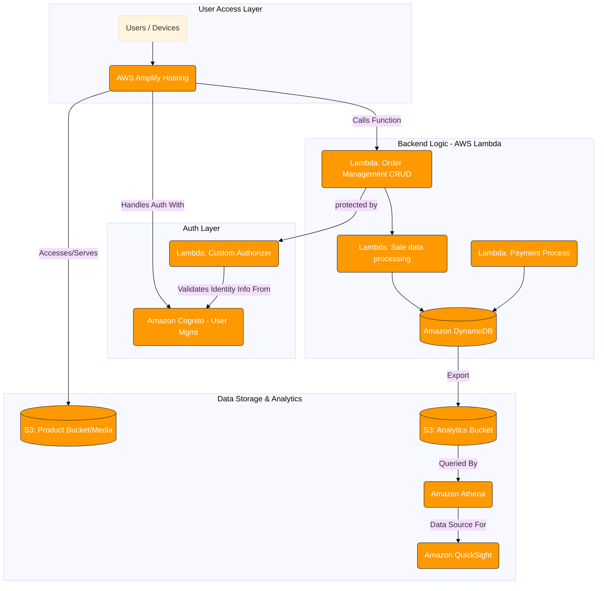

# Startup Architecture & Infrastructure

This documentation covers the **startup-phase** architecture and infrastructure-as-code necessary to bootstrap your application. It includes:

* A visual architecture diagram (`Startup.png` and `startup.mmd`)
* A CloudFormation template (`template.yaml`) to provision core backend resources without API Gateway

---

## Table of Contents

1. [Architecture Overview](#architecture-overview)
2. [Files in This Directory](#files-in-this-directory)
3. [Visual Diagram (Mermaid and PNG)](#visual-diagram-mermaid-and-png)
4. [CloudFormation Template](#cloudformation-template)

   * [Parameters](#parameters)
   * [Resources](#resources)
   * [Outputs](#outputs)
5. [Deployment Instructions](#deployment-instructions)
6. [Extending the Template](#extending-the-template)
7. [License](#license)

---

## Files in This Directory

| File            | Description                                                                                    |
| --------------- | ---------------------------------------------------------------------------------------------- |
| `Startup.png`   | PNG rendering of the architecture diagram                                                      |
| `startup.mmd`   | Mermaid source for the diagram                                                                 |
| `template.yaml` | CloudFormation template provisioning core backend resources (no API Gateway) citeturn7file0 |

---

## Visual Diagram (Mermaid and PNG)

**Mermaid source** (`startup.mmd`): use a VS Code Mermaid extension to preview and edit.



Alternatively, view the pre-generated `Startup.png` for a static diagram.

---

## CloudFormation Template

The `template.yaml` provisions core resources **without** an API Gateway (ideal for local testing or when you’ll attach triggers later). Key sections:

### Parameters

| Parameter     | Type   | Default                  | Description                   |
| ------------- | ------ | ------------------------ | ----------------------------- |
| `ProjectName` | String | `SimpleBackendResources` | Prefix for all resource names |

### Resources

1. **DynamoDB Tables**

   * `CustomersTable` (\${ProjectName}-Customers)
   * `OrdersTable`    (\${ProjectName}-Orders) with a GSI on `userId`
   * `FeedbackTable`  (\${ProjectName}-Feedback)
2. **Cognito User Pool & Client**

   * `UserPool`
   * `UserPoolClient` (web app client for SRP auth)
3. **IAM Role (`LambdaExecutionRole`)**
   Basic execution role with permissions for DynamoDB actions, Cognito operations, and CloudWatch Logs.
4. **Lambda Functions** (inline code placeholders)

   * `RegisterUserFunction`
   * `LoginUserFunction`
   * `CreateOrderFunction`
   * `GetOrdersFunction`
   * `GetOrderDetailsFunction`
   * `SubmitFeedbackFunction`
   * `GetAnalyticsFunction`

Each Lambda logs the incoming event and returns a placeholder success message. Environment variables point to the relevant table or user pool.

### Outputs

| Output                    | Description                                      |
| ------------------------- | ------------------------------------------------ |
| `CognitoUserPoolId`       | ID of the created Cognito User Pool              |
| `CognitoUserPoolClientId` | ID of the Cognito User Pool Client               |
| `CustomersTableName`      | Name of the Customers DynamoDB table             |
| `OrdersTableName`         | Name of the Orders DynamoDB table                |
| `FeedbackTableName`       | Name of the Feedback DynamoDB table              |
| `LambdaExecutionRoleArn`  | ARN of the IAM role used by all Lambda functions |

---

## Deployment Instructions

1. **Save** the template as `template.yaml`.

2. **Deploy** with the AWS CLI:

   ```bash
   aws cloudformation deploy `
     --stack-name startup-backend-stack `
     --template-file template.yaml `
     --parameter-overrides ProjectName=MyStartupProj `
     --capabilities CAPABILITY_NAMED_IAM
   ```

3. **Verify** outputs in AWS CloudFormation console or via:

   ```bash
   aws cloudformation describe-stacks --stack-name startup-backend-stack
   ```

4. **Attach** triggers (API Gateway, EventBridge, etc.) to your Lambdas as needed.

5. **Test** the Lambdas using the AWS CLI or the AWS Console.
```
aws lambda invoke `
    --function-name MyStartupProj-RegisterUser `
    --cli-binary-format raw-in-base64-out `
    --payload '{\"name\": \"Martin\"}' `
    response.json

```
---

## License

MIT License. Feel free to adapt this for your startup PoC or hackathon demos.
